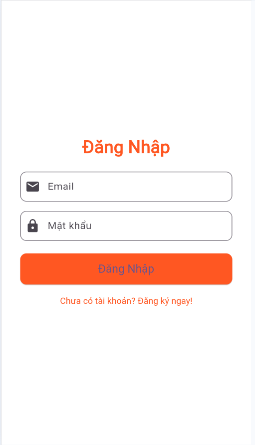
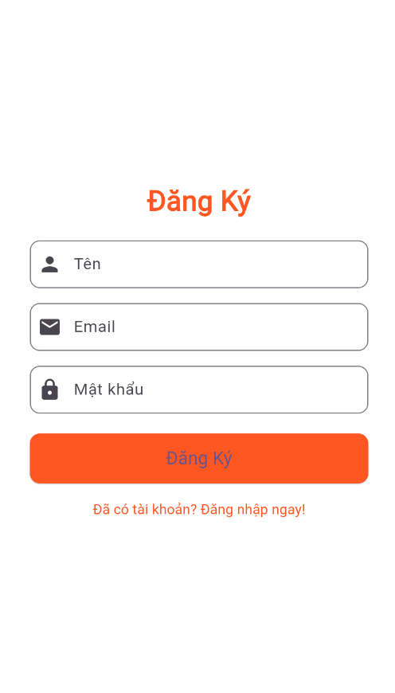
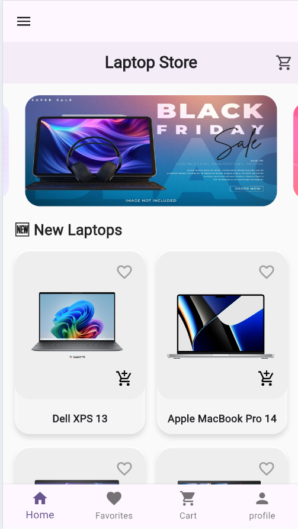
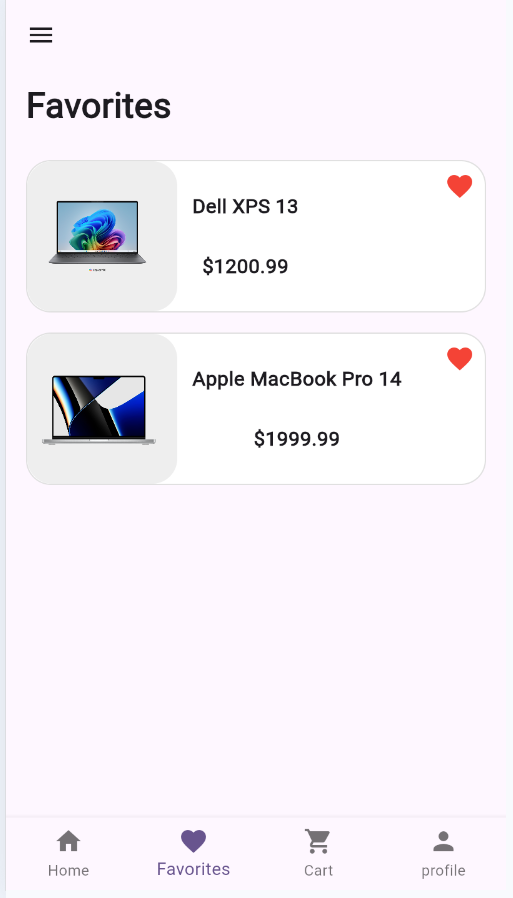
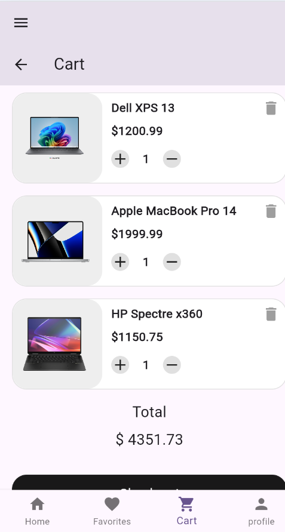

<h2 align="center">
    <a href="https://dainam.edu.vn/vi/khoa-cong-nghe-thong-tin">
    🎓 Faculty of Information Technology (DaiNam University)
    </a>
</h2>
<h2 align="center">
    ỨNG DỤNG BÁN HÀNG LAPTOP TRÊN DI ĐỘNG 
</h2>
<div align="center">
    <p align="center">
        
        
        
    </p>

[](https://www.facebook.com/DNUAIoTLab)
[](https://dainam.edu.vn/vi/khoa-cong-nghe-thong-tin)
[](https://dainam.edu.vn)

</div>

## 📖 1. Giới thiệu hệ thống  

Ứng dụng **bán hàng laptop** giúp người dùng **xem, lựa chọn và mua laptop gaming hoặc văn phòng** trực tiếp trên thiết bị **Android hoặc iOS**.  
Được phát triển bằng **Flutter Framework** với **Firebase / Node.js** làm backend.  

---

## 🏗️ Kiến trúc hệ thống  

### 🔹 Máy chủ (Server API)
- Lưu trữ dữ liệu sản phẩm, đơn hàng, tài khoản người dùng.  
- Cung cấp **API RESTful** để giao tiếp với ứng dụng di động.  
- Xử lý yêu cầu: **đăng nhập, xem sản phẩm, đặt hàng, thanh toán.**  

### 🔹 Ứng dụng di động (Mobile App – Client)
- Giao diện **UI/UX thân thiện**, dễ sử dụng.  
- Kết nối đến **Server API / Firebase** để lấy dữ liệu và gửi đơn hàng.  
- Quản lý **giỏ hàng, tài khoản, đơn hàng** ngay trên điện thoại.  

### 🔹 Tính năng chính  

| Tính năng | Mô tả |
|------------|--------|
| 🛒 **Danh mục sản phẩm** | Hiển thị danh sách laptop theo thương hiệu và cấu hình. |
| 🔍 **Tìm kiếm & lọc** | Tìm theo tên, giá hoặc hiệu năng. |
| ❤️ **Yêu thích** | Lưu sản phẩm ưa thích để xem lại sau. |
| 🧺 **Giỏ hàng** | Thêm, xóa, cập nhật số lượng sản phẩm. |
| 💳 **Đặt hàng & thanh toán** | Gửi đơn hàng và xác nhận online. |
| 👤 **Tài khoản người dùng** | Đăng nhập, đăng ký, cập nhật thông tin cá nhân. |

---

## 🛠️ 2. Công nghệ sử dụng  

| Thành phần | Công nghệ |
|-------------|------------|
| **Mobile App** | Flutter 3.x |
| **Backend** | Firebase hoặc Node.js + MongoDB |
| **Quản lý trạng thái** | Provider / GetX |
| **Kết nối API** | RESTful API |
| **Công cụ phát triển** | Android Studio / VS Code |

---

### 🔹 Flutter 📱  
- Xây dựng giao diện và xử lý logic ứng dụng.  
- Giao diện mượt, chạy đa nền tảng Android/iOS.  

### 🔹 Firebase / Node.js ☁️  
- Lưu trữ dữ liệu, xác thực người dùng, quản lý đơn hàng.  
- Firebase Authentication + Firestore Database.  

### 🔹 Provider / GetX ⚙️  
- Quản lý trạng thái toàn cục (cart, user, order).  

### 🔹 REST API 🌐  
- Giao tiếp giữa app và máy chủ.  

---

## 🖼️ 3. Giao diện ứng dụng  

<div align="center">
  
  <p>Hình 1: UI đăng nhập</p>
</div>

<div align="center">
  
  <p>Hình 2: UI đăng ký</p>
</div>

<div align="center">
  
  <p>Hình 3: Trang chủ hiển thị các sản phẩm</p>
</div>

<div align="center">
  
  <p>Hình 4: Trang hiển thị danh sách các sản phẩm yêu thích</p>
</div>

<div align="center">
  
  <p>Hình 5: Trang hiển thị giỏ hàng</p>
</div>

<div align="center">
  
  <p>Hình 6: Trang hiển thị </p>
</div>

---

## 🧩 4. Hướng dẫn cài đặt và sử dụng  

### ⚙️ Yêu cầu hệ thống  
- Flutter SDK 3.0+  
- Android Studio hoặc Visual Studio Code  
- Thiết bị Android/iOS hoặc trình giả lập  
- Kết nối Internet  

---

### 🚀 Cài đặt  

1. Clone project:  
   ```bash
   git clone https://github.com/username/laptop_store_app.git
   cd laptop_store_app
2. Cài đặt các gói phụ thuộc:
   ```bash
   flutter pub get
3. Cấu hình Firebase (nếu có)
- Thêm file google-services.json vào android/app
- (Nếu dùng iOS) thêm GoogleService-Info.plist vào dự án iOS
4. Chạy ứng dụng
   ```bash
   flutter run

---
### ▶️ Cách sử dụng
🔹 Dành cho khách hàng
- Mở ứng dụng
- Đăng nhập hoặc tạo tài khoản mới
- Duyệt danh mục sản phẩm
- Thêm laptop vào giỏ hàng
- Thanh toán và theo dõi đơn hàng

---
# 📞 5. Liên hệ
- **Họ tên:** Lê Hải Đăng  
- **Lớp:** CNTT 16-04  
- **Email:** dangngoc1122004@gmail.com  
- **Zalo:** 0377968152  
---


## © 2025 AIoTLab, Faculty of Information Technology, DaiNam University. All rights reserved.
